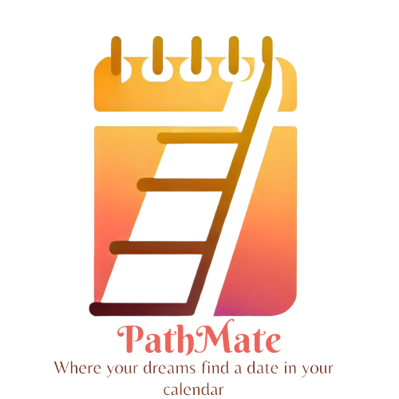

# PathMate: Your AI-Powered Roadmap for Career Success
  
*Submitted for ShellHacks 2023*

## Overview
PathMate is designed to bridge the gap between aspiring professionals—or anyone looking to achieve a specific set of goals—and the realization of those goals. Through AI-powered roadmaps, PathMate provides a holistic development solution covering everything from legal paperwork to skills enhancement opportunities. This app is perfect for students, young professionals, and anyone looking to streamline their career path.

## Features
- **AI-Powered Roadmaps**: Custom roadmaps generated using advanced Natural Language algorithms.

- **Task Interactivity**: Each task on the roadmap is clickable for more details, deletion, or marking as done.
- **Holistic Solutions**: From visa paperwork to coding skills, we have got you covered.
- **User-Friendly UI**: Easy to navigate and use, helping you to focus on what truly matters.

## Technology Stack
- **AI and Machine Learning**
- **Python for backend logic**
- **Django for web framework**
- **JavaScript for frontend interactions**
- **SQL for databases**
- **MindDBS for prompt engineering**
- **Github for Version control**
- **Github Global Campus for learning and Github Copilot**
- **Github sites for site deployment**
- **GoDaddy for Domain registry**
- **Auth0 for user authorization account login**

## Installation & Setup
For now, the project is not open source, but its use is free to all users at [PathMateAI](http://pathmateai.co/).

## How to Use
1. **Sign Up**: Create a new account or sign in.
2. **Input Goals**: Enter your career goals or objectives.
3. **Input Current Situation**: Enter your current skills, situation.
4. **Generate Roadmap**: Click on "Generate" and your AI-powered roadmap will be displayed.
5. **Task Interactions**: Click on tasks for more details, mark them as done, or delete them.

## Acknowledgements
The team would like to thank ShellHacks 2023 for the opportunity to participate in this hackathon. Special thanks to our mentors and advisors.

## Contact
For more information or to report issues, please contact us at [info@pathmateai.co](mailto:info@pathmateai.co).
